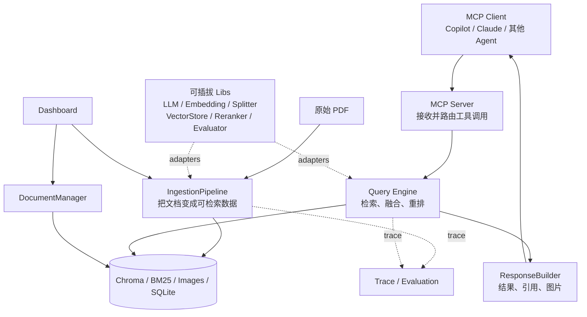

# 架构导读

更新日期：2026-09-20。状态：学习导读，基于上游 `main` 的 `DEV_SPEC` 和实际目录整理；当前 `learning/from-zero` 分支尚未实现这些模块。

这份文档只回答三个问题：整个系统由哪些模块组成、数据怎样流动、为什么它可以替换不同实现。完整设计与任务拆分以 [DEV_SPEC](../DEV_SPEC.md) 为准。

## 1. 先看全局



可以把系统类比为一座图书馆：

- `Ingestion` 是图书加工和编目，把新书整理成可查询的目录。
- `Storage` 是书架、目录卡和图片柜，不同数据放在不同位置。
- `Query Engine` 是检索员，先广泛找候选，再把最相关的排在前面。
- `ResponseBuilder` 是结果整理员，为片段添加来源和图片。
- `MCP Server` 是统一服务窗口，让不同 AI 客户端用同一种方式请求知识。
- `Trace / Evaluation` 是工作记录与质检，用来解释为什么找到了这些结果。

## 2. Module、Interface、Seam 和 Adapter

### Module

Module 是一块具有明确职责的代码。例如：

- `IngestionPipeline` 是摄取 module。
- `HybridSearch` 是混合检索 module。
- `ResponseBuilder` 是响应构建 module。

一个 module 包含两部分：调用者看到的 interface，以及藏在内部的 implementation。

### Interface

Interface 是调用者正确使用一个 module 时必须知道的全部内容，不只是一行函数定义，还包括输入输出、错误、调用顺序和约束。

例如可以把上游 `HybridSearch` 的核心 interface 简化理解为：

```text
search(query, top_k, filters) → RetrievalResult[]
```

调用者只需要提供查询条件并接收结果，不需要知道 Dense、BM25 和 RRF 如何配合。

### Seam

Seam 是可以替换行为而不修改调用者的位置。它通常由一个稳定 interface 形成。

例如 Embedding seam：

```text
                    ┌─ OpenAIEmbedding adapter
BaseEmbedding ──────┼─ AzureEmbedding adapter
                    └─ OllamaEmbedding adapter
```

上层只依赖 `BaseEmbedding` 的 interface。切换 adapter 时，上层摄取流程不需要重写。Seam 不是一个特殊框架，也不一定对应单独文件；它描述的是“从哪里替换实现”。

### Adapter

Adapter 是放在 seam 上的具体实现。在上面的例子里，OpenAI、Azure 和 Ollama 的 Embedding 实现都是 adapter。

“可插拔”的完整含义是：

```text
稳定 interface + 明确 seam + 多个 adapter + 配置选择
```

只有一个实现、没有替换需求时，先写抽象接口可能只是增加复杂度。上游的 Embedding、LLM、Reranker 和 VectorStore 都有多个实现，因此这些 seam 是真实存在的。

## 3. 可插拔 Libs 是什么

`src/libs/` 不是指所有第三方依赖，而是上游集中放置“可替换能力”的目录：

| 能力 | 稳定 interface | adapter 示例 | 谁使用它 |
|---|---|---|---|
| LLM | `BaseLLM` | OpenAI、Azure、DeepSeek、Ollama | Transform、LLM Rerank |
| Vision LLM | `BaseVisionLLM` | Azure Vision 等 | ImageCaptioner |
| Embedding | `BaseEmbedding` | OpenAI、Azure、Ollama | DenseEncoder、DenseRetriever |
| Splitter | `BaseSplitter` | RecursiveSplitter | DocumentChunker |
| VectorStore | `BaseVectorStore` | ChromaStore | Upsert、DenseRetriever、管理模块 |
| Reranker | `BaseReranker` | None、Cross-Encoder、LLM | 查询链路 |
| Evaluator | `BaseEvaluator` | Custom、Ragas | 评估链路 |

Factory 根据配置选择 adapter。例如配置选择 Ollama 后，调用者仍然面对同一个 Embedding interface。

## 4. Ingestion 是什么

Ingestion 通常译为“摄取”。它不是回答问题，而是把原始资料加工成以后可以检索的数据，通常离线执行。

上游摄取链：

```text
原始 PDF
  → SHA256：是否处理过、内容是否变化
  → Loader：解析为 Document，并提取图片和元数据
  → Splitter：把 Document 切成 Chunk[]
  → Transform：去噪、补充标题/摘要/标签、生成图片描述
  → DenseEncoder：生成语义向量
  → BM25Indexer：生成关键词倒排索引
  → Upsert：写入 Chroma、BM25、图片存储和完整性记录
```

几个核心数据对象：

```text
Document    一份标准化后的完整文档
Chunk       从文档切出的可处理片段
ChunkRecord 加入向量和增强元数据、可以存储的片段
```

为什么要单独做摄取？因为解析 PDF、生成图片描述和计算 Embedding 可能很慢，但同一份文档会被查询很多次。提前处理一次，可以让查询更快。

## 5. Query 是什么

Query 是用户真正提问时运行的在线链路：

```text
用户问题
  → QueryProcessor：提取关键词和过滤条件
  → DenseRetriever：按语义找候选
  → SparseRetriever：按 BM25 关键词找候选
  → RRF：合并两份排名
  → Reranker：对候选做更精细的排序
  → ResponseBuilder：组装文本、引用和图片
  → MCP Client
```

Dense 和 Sparse 并不是重复工作：

- Dense 适合语义相近但用词不同的问题。
- Sparse 适合专有名词、编号和精确关键词。
- RRF 根据排名融合两条路线。
- Reranker 只能重排已经召回的候选，不能找回遗漏的证据。

## 6. MCP、CLI 和 Dashboard 的关系

它们是不同入口，不是三套 RAG：

- MCP Server：让外部 AI 客户端调用 `query_knowledge_hub` 等工具。
- CLI：供开发和调试，直接运行摄取、查询和评估脚本。
- Dashboard：浏览数据、触发摄取、删除文档、查看 Trace 和评估结果。

它们应该复用下层 module。上游中 `query.py` 和 MCP Tool 都调用查询链，但输出形式不同。

## 7. 为什么有多种 Storage

不同存储解决不同问题：

| 存储 | 保存什么 | 解决什么问题 |
|---|---|---|
| Chroma | Chunk、Dense Vector、Metadata | 语义向量检索 |
| BM25 Index | 词频、倒排索引、IDF | 关键词检索 |
| Image Store | 图片文件和映射 | 返回原始图片 |
| Integrity SQLite | 文件哈希和处理状态 | 增量摄取、避免重复处理 |
| Trace JSONL | 各阶段输入、结果和耗时 | 调试、观测和评估 |

DocumentManager 删除一篇文档时，需要协调这些存储，避免只删了向量却留下 BM25、图片或哈希记录。

## 8. 当前需要掌握到什么程度

现在先记住四句话：

1. Ingestion 把资料变成索引，Query 使用索引找证据。
2. Libs 提供可以替换的能力，Factory 根据配置选择 adapter。
3. Seam 是替换实现的位置，Interface 是 seam 上的使用规则。
4. MCP、CLI、Dashboard 是入口，共享下面的摄取、查询和存储 module。

当前分支已在本地完成阶段 A，并通过 B1、B2 把 LLM 与 Embedding seam 落成真实 interface 和 Factory；尚未实现真实模型 adapter 或 Ingestion。阶段 B、C 会继续把其他可插拔能力和摄取 module 逐个落成代码。
